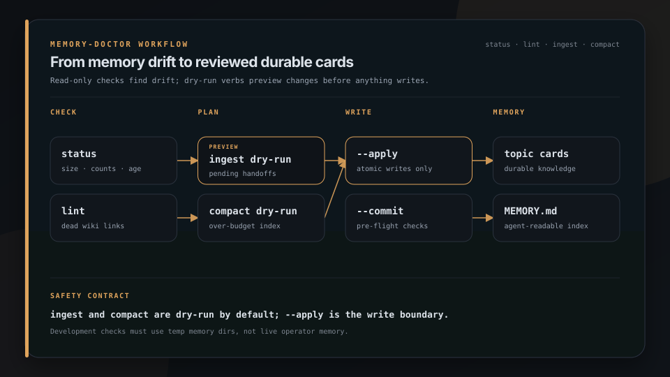

<p align="center">
  
</p>

<h1 align="center">Memory Doctor</h1>

<p align="center">
  
</p>

<p align="center">
  <strong>Agent memory rots quietly. Doctor checks it before sessions pay the cost.</strong>
</p>

<p align="center">
  Maintenance CLI for file-based agent memory: status, lint, ingest, compact for Claude Code and OpenClaw layouts. Much of this is now embedded in brigade-cli as brigade memory.
</p>

<p align="center">
  <a href="https://brigade.tools/memory-doctor">Website</a> · <a href="#install">Install</a> · <a href="https://github.com/escoffier-labs/brigade">brigade memory (embedded)</a>
</p>

<p align="center">
  
  
</p>

## Install

```bash
# Preferred path: embedded in Brigade
pipx install brigade-cli
brigade memory status
brigade memory lint
brigade memory compact

# Standalone (legacy package)
pipx install memory-doctor   # if published; else clone this repo
```

## What it does

| | Job | What you get |
|---|---|---|
| **Status** | See the footprint | Cards, index size, pending handoffs |
| **Lint** | Catch dead links | Missing card targets in wiki links and index Markdown links |
| **Compact** | Stay under budget | Flatten bloated MEMORY.md into topic cards |
| **Ingest** | Promote handoffs | Bridge notes into durable memory carefully |
| **Init Git** | Make changes reviewable | Initialize and baseline the memory directory |



Generated from [`docs/assets/workflows/memory-care.json`](docs/assets/workflows/memory-care.json) with `plating workflow`.


## Quickstart

```bash
# Read-only health summary of the memory dir (no writes, exits 0):
memory-doctor status

# Find dead wiki links and index Markdown links (exits 1 if any):
memory-doctor lint

# One-time setup for optional commit-backed apply operations:
memory-doctor init-git

# Preview promoting pending handoffs into cards (dry-run):
memory-doctor ingest
memory-doctor ingest --apply        # actually write

# Preview compacting an oversized MEMORY.md (dry-run):
memory-doctor compact
memory-doctor compact --apply       # actually write
```

Set `--memory-dir`, `--cards-dir`, and `--handoffs-dir` or the matching env vars for your layout (see [Configuration](#configuration)). `status` and `lint` support separate index and card directories. `ingest` and `compact` require cards beside MEMORY.md and reject split layouts even in dry-run mode.

## Configuration

| What | Flag | Env | Default |
|---|---|---|---|
| Memory dir (MEMORY.md, also cards in flat layouts) | `--memory-dir PATH` | `MEMORY_DOCTOR_MEMORY_DIR` | `~/.claude/projects/<project-scope>/memory` |
| Cards dir | `--cards-dir PATH` | `MEMORY_DOCTOR_CARDS_DIR` | Resolved memory dir |
| Handoffs dir | `--handoffs-dir PATH` | `MEMORY_DOCTOR_HANDOFFS_DIR` | `~/.openclaw/workspace/.claude/memory-handoffs` |
| MEMORY.md threshold (lines) | `--max-lines N` | `MEMORY_DOCTOR_MAX_LINES` | `180` |
| MEMORY.md threshold (bytes) | `--max-bytes N` | `MEMORY_DOCTOR_MAX_BYTES` | `24000` |
| Commit verb output | `--commit` / `--no-commit` | `MEMORY_DOCTOR_COMMIT` | off |
| Commit author override | `--commit-author "Name <e>"` | `MEMORY_DOCTOR_COMMIT_AUTHOR` | from git config |

`<project-scope>` is derived from the home-directory path by replacing each `/` with `-` (e.g. `/home/alice` becomes `-home-alice`). The memory default uses Claude Code's flat layout, while the handoffs default uses the OpenClaw workspace inbox. Flags override env vars, which override defaults.

For a split layout, pass the directory containing MEMORY.md as `--memory-dir` and the card directory as `--cards-dir`. This example creates a temporary store and runs both read-only verbs without accessing live memory:

```bash
split_demo_dir="$(mktemp -d)"
mkdir -p "$split_demo_dir/memory/cards" "$split_demo_dir/handoffs"
printf '# Topic\n' > "$split_demo_dir/memory/cards/topic.md"
printf '%s\n' '- [Topic](cards/topic.md#details)' > "$split_demo_dir/memory/MEMORY.md"
memory-doctor status --memory-dir "$split_demo_dir/memory" \
  --cards-dir "$split_demo_dir/memory/cards" --handoffs-dir "$split_demo_dir/handoffs"
memory-doctor lint --memory-dir "$split_demo_dir/memory" \
  --cards-dir "$split_demo_dir/memory/cards" --handoffs-dir "$split_demo_dir/handoffs"
rm -r "$split_demo_dir"
```

The byte threshold defaults to 24000 because the Claude Code harness silently drops MEMORY.md content read beyond a ~24.4KB limit. An index that is fine on the line count can still have its tail invisible to the agent, so `status` and `compact` track both.

## What each verb does

### `status`

Prints memory dir path, card count, MEMORY.md line+byte count, line and byte threshold status (each marked ok or OVER), dead-link count, handoffs dir path, pending + processed counts, oldest pending age. Exits 0. `--json` for a structured payload (includes `over_threshold`, `max_lines`, `over_bytes`, `max_bytes`).

### `lint`

Scans card `.md` files in the cards dir and MEMORY.md in the memory dir for `[[wiki-link]]` references. Also checks local Markdown links in MEMORY.md against card slugs, accepting the `cards/` prefix and checking the file portion before a `#fragment`. Pure anchors, external URLs, mail links, and other nested paths are ignored. Heading existence is not checked. Reports dead links grouped by source file with a closest-match suggestion (Levenshtein distance ≤ 3). Exits 0 if zero dead links, 1 if any (so you can gate a pre-commit hook on it).

### `ingest`

Sweeps the handoffs dir for unprocessed `*.md` files matching the standard handoff template. For each one:

- `Recommended memory action: create-card` writes a new card to the memory dir. Skips on conflict (use `--force` to overwrite)
- `Recommended memory action: update-card` appends the suggested content to an existing card. Errors if the target is missing
- `Recommended memory action: no-card` just moves the handoff to `processed/`

Successful handoffs are moved into `<handoffs-dir>/processed/`. Dry-run by default. `--apply` writes.
Parsing is capped at 1 MiB per handoff and 256 KiB for the suggested card content. Oversized handoffs fail before any target card is changed and the error reports the applicable byte limit.

Apply runs are serialized per memory directory. Before the first write or handoff move, memory-doctor records a private recovery journal. A failed write or move restores the original files and inbox state. The next apply also restores an interrupted transaction before doing new work. Existing names under `processed/` are treated as collisions and must be resolved by the operator.

### `compact`

Reads MEMORY.md, counts lines and bytes. Triggers when MEMORY.md is over the line threshold OR the byte threshold. Two non-lossy passes:

- Flatten: for multi-line entries (bullets whose detail spans more than one line), keep the one-liner in the index and append the detail to the target topic file under a `## From index (YYYY-MM-DD)` section.
- Tighten: for single-line entries whose hook exceeds `max_hook_chars` (default 140) and whose linked card exists, append the full hook to the card under the same breadcrumb and rewrite the index line with a word-boundary-truncated hook ending in `...`. Dangling links (no card on disk) are left full, since the index may be the only record. No `](...)` pointer is ever dropped.

Every rewritten line is normalized to ASCII punctuation (em dash, en dash, and a few other glyphs become `-`, `->`, `>=`, `<=`, `~`), with a final whole-file normalization pass on apply. Link targets are never touched. Dry-run by default. `--apply` writes (topic files first, MEMORY.md last). Refuses if a target topic file is missing for a flatten candidate (would orphan content). Warns if compaction alone won't bring MEMORY.md under either threshold. Re-running `--apply` is a no-op.

## Commit integration (v0.2)

`ingest --apply` and `compact --apply` can be tied to a git commit in the memory dir so every write is reviewable and revertable.

```bash
# One-time setup: turn the memory dir into a git repo.
memory-doctor init-git

# Each --apply now produces one commit.
memory-doctor ingest --apply --commit
memory-doctor compact --apply --commit
```

`init-git` checks the effective `user.name` and `user.email`, then commits only
top-level memory Markdown files plus `.gitignore`. If initialization stops
before the first commit, fix the reported Git error and rerun the same command.
It resumes the partial repository.

Off by default. Opt in via `--commit` or `MEMORY_DOCTOR_COMMIT=1`. When the
environment variable enables commit mode without an explicit `--commit`, the
CLI prints a notice naming the variable. `--no-commit` overrides the env var
for a single run and suppresses that notice.

Author overrides must use the printable `Name <local@domain>` form. Values
from either `--commit-author` or `MEMORY_DOCTOR_COMMIT_AUTHOR` are rejected
before writes if the name or email is malformed or contains control
characters.

Pre-flight checks (any failure aborts the run, writes nothing):
1. Memory dir is a git repo (otherwise: `run memory-doctor init-git`).
2. No uncommitted local changes on the files this verb would touch (protects in-flight manual edits).
3. Git is not in the middle of a merge, rebase, cherry-pick, or bisect.

Check 2 also runs on plain `--apply` (without `--commit`) whenever the memory dir is a git repo: applying over uncommitted edits would bury them with no committed baseline to diff against. Commit or stash first, then retry.

Commit message shape:

```
memory-doctor ingest: 3 handoffs promoted

- foo.md (create-card from 2026-05-22_foo.md)
- bar.md (update-card append from 2026-05-22_bar.md)
- baz.md (create-card from 2026-05-22_baz.md)
```

No `Co-Authored-By` or `Generated with` trailers. The subject already identifies the tool.

`--commit` without `--apply` is a no-op and exits 0 (friendly for experimentation).

If git rejects the commit after writes succeed, memory-doctor preserves the completed file and handoff changes and exits non-zero. Hook failures leave the touched files staged. If staging itself failed, review `git status`, add the intended files, and commit them manually.

## Examples

```bash
# Daily morning check:
memory-doctor status

# Drain the inbox:
memory-doctor ingest --apply

# Bring MEMORY.md back under threshold:
memory-doctor compact --apply

# Pre-push hook:
memory-doctor lint
```

## Development

Install test dependencies and run the suite:

```bash
python3 -m pip install -e '.[dev]'
./scripts/verify
```

The verification gate runs pytest, builds the wheel, installs it without dependencies in a fresh virtual environment, runs `memory-doctor --version` and a read-only `status`, and checks installed package metadata against the module version.

## Why not other tools?

- **mem0, Letta, and hosted memory layers** are built for apps you are shipping, usually behind an API or a server. Memory Doctor is for the agent CLIs you already run, and it never owns your memory. Your cards stay plain markdown on disk, readable and editable without it, and Memory Doctor only checks and tidies what is already there.
- **A harness's own auto-memory** keeps writing to a silo without review and has no concept of dead links or a read-limit cliff. Memory Doctor adds the linter, the byte-aware threshold, and the dry-run-by-default mutations the built-in memory never gave you.
- **A hand-rolled shell script or pre-commit hook** is exactly the thing this replaces. Memory Doctor gives you the dead-link linter, the non-lossy compactor, and the handoff ingester as one tested CLI with a stable exit-code contract, instead of glue you maintain forever.
- **A daemon or background watcher** would be simpler to demo and worse to trust. Memory Doctor only runs when you run a verb, writes nothing without `--apply`, and makes no network calls.

## What memory-doctor is not

Memory Doctor is not a memory store, a hosted service, or a background agent.

It does not:

- run in the background, watch files, or install schedulers
- make network calls or handle credentials
- write anything without an explicit `--apply` (`status` and `lint` never write at all)
- invent or summarize memory content. It checks links, tracks size, moves handoffs, and tightens overlong index lines without losing any pointer

What it edits is mechanical and reversible. The content of your memory is yours to curate.

## License

MIT. See [LICENSE](LICENSE).

---

Project identity: GitHub [`escoffier-labs/memory-doctor`](https://github.com/escoffier-labs/memory-doctor), website [memory-doctor.escoffierlabs.dev](https://memory-doctor.escoffierlabs.dev), PyPI [`memory-doctor`](https://pypi.org/project/memory-doctor/), command `memory-doctor`.
